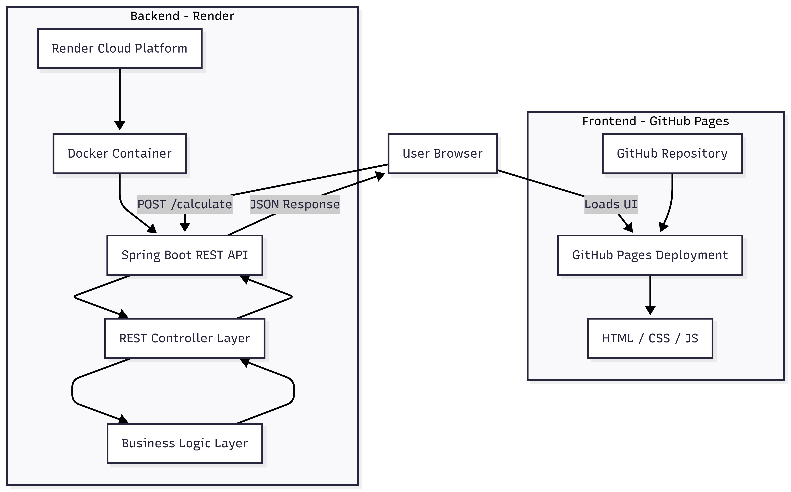

# StaySplit

StaySplit is a full-stack web application that fairly splits shared utility bills among roommates based on the number of days each person stayed. The system ensures transparent and accurate cost distribution using a Spring Boot REST API backend and a clean, responsive frontend.

---

## Live Demo

Visit the Website:  
https://sujalpatil21.github.io/StaySplit/

---

## Problem Statement

In shared living environments, roommates often stay for different durations, making equal bill splitting unfair. StaySplit solves this by calculating each person's share proportional to their stay duration.

---

## Features

- Add and remove roommates dynamically  
- Input number of days stayed per person  
- Automatic proportional bill calculation  
- REST-based backend architecture  
- Deployed full-stack system  
- Cross-origin enabled communication  
- Clean and responsive UI  

---

## System Architecture

StaySplit follows a client-server architecture with independent frontend and backend deployments.

- Frontend hosted on GitHub Pages  
- Backend containerized using Docker  
- Backend deployed on Render  
- REST-based communication between frontend and backend  

### Architecture Diagram

---

### Architecture Overview

**Client Layer**
- User interacts through browser  
- Static frontend served via GitHub Pages  
- Sends HTTP POST requests to backend  

**Frontend Layer**
- HTML, CSS, JavaScript  
- Handles form input and result rendering  
- Communicates with backend using Fetch API  

**Backend Layer**
- Spring Boot REST API  
- Controller layer handles HTTP requests  
- Service layer performs bill calculation logic  
- Returns structured JSON response  

**Containerization**
- Backend packaged inside Docker container  
- Docker image deployed on Render  

**Communication**
- REST API over HTTP  
- JSON request and response format  
- CORS enabled for cross-origin requests  

---

## Tech Stack

### Frontend
- HTML5  
- CSS3  
- JavaScript  

### Backend
- Java 21  
- Spring Boot  
- Maven  

### Deployment
- Docker (Backend Containerization)  
- Render (Backend Hosting)  
- GitHub Pages (Frontend Hosting)  

---

## Data Flow

1. User enters bill amount and roommate details  
2. Frontend sends POST request to backend  
3. Backend processes data and calculates proportional shares  
4. Backend returns computed results in JSON format  
5. Frontend displays the result table  

---

## Deployment Strategy

- Backend containerized using Docker  
- Backend deployed on Render cloud platform  
- Frontend hosted using GitHub Pages  
- Environment variables managed securely on Render  

---

## Error Handling

- Input validation for empty and invalid fields  
- Numeric validation for bill amount and days  
- Graceful JSON parsing  
- User-friendly error messages  

---

## Future Enhancements

- User authentication and login system  
- Persistent database integration  
- Bill history tracking  
- Export reports in PDF or CSV  
- Mobile application version  

---

## License

MIT License

---

## Author

Sujal Patil  
https://github.com/SujalPatil21  
https://www.linkedin.com/in/sujalbpatil21  
mailto:sujalpatil21@gmail.com
